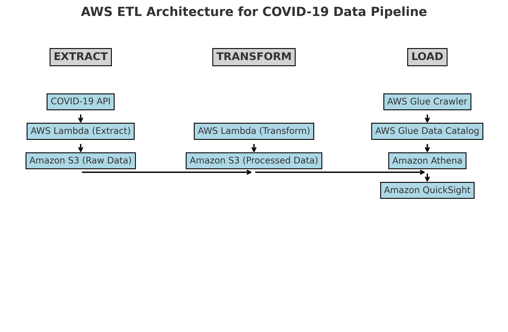

# aws-etl-covid19-pipeline
AWS ETL pipeline for COVID-19 data analysis using Lambda, S3, Glue, Athena, and QuickSight.

## Project Overview
This project builds a **fully automated AWS ETL pipeline** to extract COVID-19 data, transform it, and analyze it using **AWS Athena & QuickSight**.

## Goal:
- Automate the extraction of COVID-19 data using **AWS Lambda**.
- Convert **raw JSON data to CSV** and store it in **Amazon S3**.
- Use **AWS Glue & Athena** to query the data.
- Build **interactive dashboards in QuickSight & Tableau**.

---

## **AWS Services Used**
 **AWS Lambda** (Extract & Transform functions)  
 **Amazon S3** (Raw & Processed Data Storage)  
 **AWS Glue** (Schema Discovery & Data Catalog)  
 **AWS Athena** (Querying S3 data using SQL)  
 **Amazon QuickSight** (Data Visualization)  
 **AWS CloudWatch** (Automated Event Triggers)  

---

## **ETL Pipeline Architecture**

